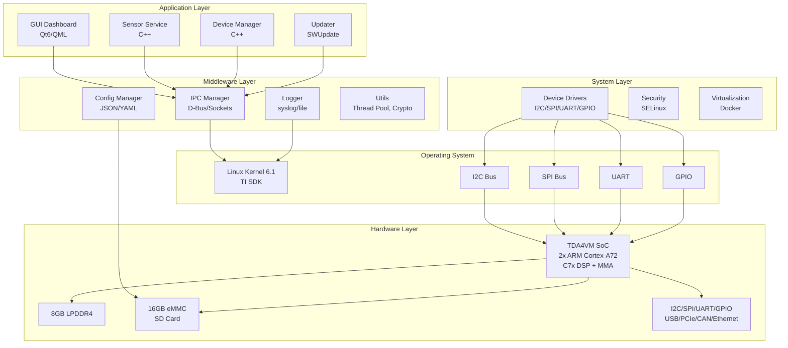
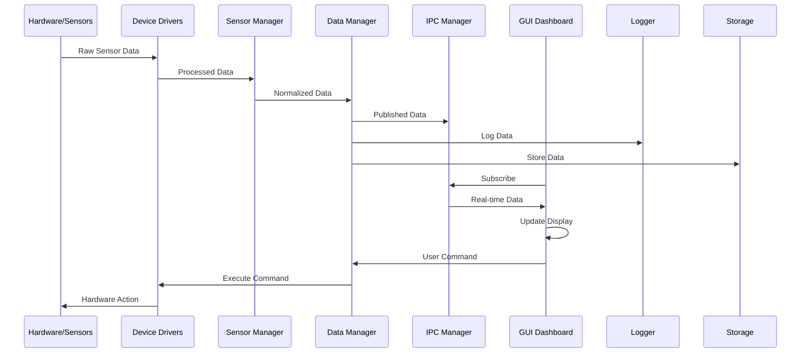
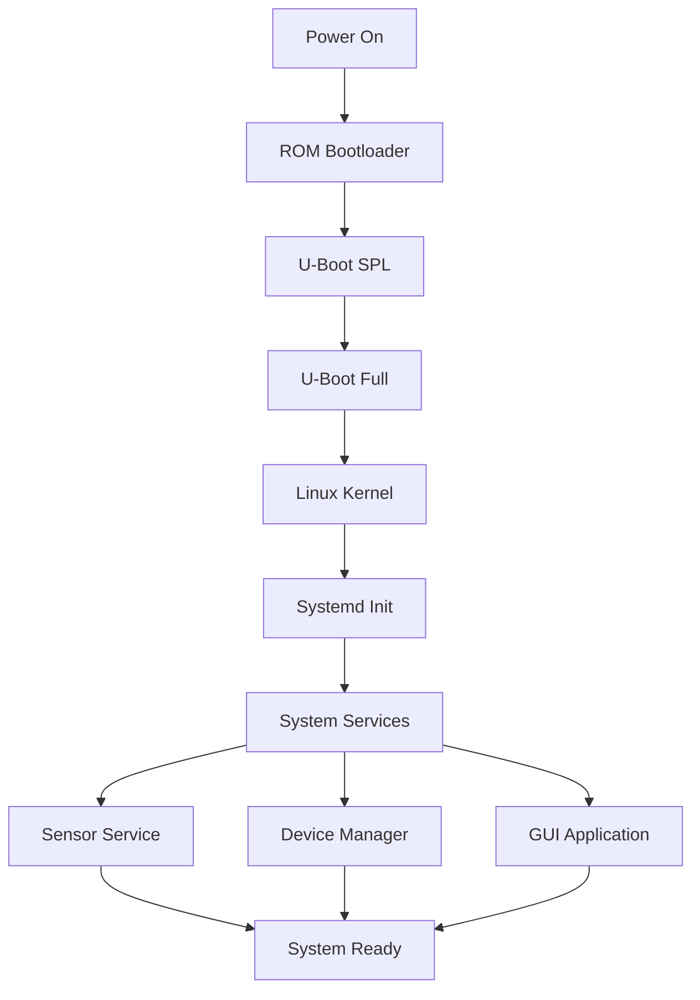
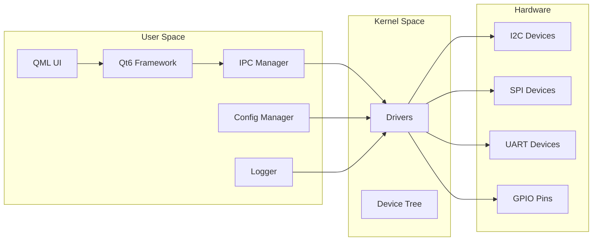
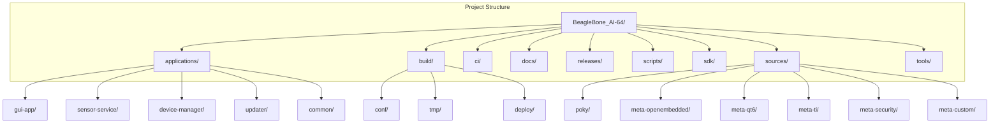

```markdown
<div align="center">

#  BBB AI-64 Yocto Project

[](https://www.yoctoproject.org/)
[](https://www.kernel.org/)
[](https://www.qt.io/)
[](LICENSE)
[](https://github.com/yourusername/BeagleBone_AI-64/actions)
[](https://beagleboard.org/ai-64)
[](https://github.com/yourusername/BeagleBone_AI-64/pulls)

**Complete Embedded Linux Distribution for BeagleBone Black AI-64**

[Documentation](docs/) • [Quick Start](#-quick-start) • [Architecture](#-system-architecture) • [Features](#-features) • [Contributing](CONTRIBUTING.md)

</div>

---

##  Table of Contents

- [Overview](#-overview)
- [System Architecture](#-system-architecture)
- [Quick Start](#-quick-start)
- [Features](#-features)
- [Hardware Support](#-hardware-support)
- [Software Stack](#-software-stack)
- [Development](#-development)
- [Project Structure](#-project-structure)
- [Deployment](#-deployment)
- [Contributing](#-contributing)
- [License](#-license)

---

##  Overview

The **BBB AI-64 Yocto Project** is a complete, production-ready embedded Linux distribution for the [BeagleBone Black AI-64](https://beagleboard.org/ai-64) board. Built on the Yocto Project, it provides a robust, secure, and high-performance platform for IoT, edge AI, and industrial applications.

### Key Highlights

-  **Production-Ready**: Complete Yocto build system with custom layers
-  **AI-Powered**: TDA4VM SoC with C7x DSP and MMA (8 TOPS)
-  **Rich GUI**: Qt6-based dashboard with real-time visualization
-  **Sensor Fusion**: Comprehensive sensor support (IMU, GPS, Temperature, Pressure, Humidity)
-  **Industrial IoT**: MQTT, OPC UA, Modbus, CAN bus support
-  **OTA Updates**: SWUpdate for secure over-the-air updates
-  **Containerization**: Docker support for microservices
-  **Security**: SELinux, secure boot, encrypted storage
-  **CI/CD Ready**: Jenkins, GitLab CI, GitHub Actions

---

## 🏗️ System Architecture

### High-Level Architecture



### Data Flow Diagram



### Boot Flow Diagram



### Component Interaction Diagram



---

##  Quick Start

### Prerequisites

```bash
# Ubuntu/Debian
sudo apt-get update
sudo apt-get install -y \
    gawk wget git diffstat unzip texinfo gcc build-essential \
    chrpath socat cpio python3 python3-pip python3-pexpect \
    xz-utils debianutils iputils-ping python3-git python3-jinja2 \
    libegl1-mesa libsdl1.2-dev xterm python3-subunit mesa-common-dev \
    zstd liblz4-tool

# Install repo tool
mkdir -p ~/.local/bin
curl https://storage.googleapis.com/git-repo-downloads/repo > ~/.local/bin/repo
chmod a+x ~/.local/bin/repo
export PATH="$HOME/.local/bin:$PATH"
```

### Clone and Build

```bash
# Clone repository
git clone https://github.com/yourusername/BeagleBone_AI-64.git
cd BeagleBone_AI-64

# Setup host environment
./scripts/setup-host.sh

# Build the image
./scripts/build-image.sh custom-image

# Flash to SD card
./scripts/flash-sdcard.sh custom-image /dev/sdX
```

### First Boot

```bash
# Connect serial console
screen /dev/ttyUSB0 115200

# Login
login: root
password: (none)

# Configure WiFi
connmanctl enable wifi
connmanctl scan wifi
connmanctl services
connmanctl connect <service-name>

# Start GUI
systemctl start gui-app
```

---

## ✨ Features

### 🌐 Core Features

| Feature | Description | Status |
|---------|-------------|--------|
| **Yocto Build System** | Complete build environment with custom layers | ✅ |
| **Qt6 GUI** | Modern dashboard with real-time data visualization | ✅ |
| **Sensor Service** | Comprehensive sensor management framework | ✅ |
| **Device Manager** | Hardware abstraction and control | ✅ |
| **OTA Updates** | Secure over-the-air updates with SWUpdate | ✅ |
| **IPC Framework** | D-Bus and socket-based communication | ✅ |
| **Configuration Manager** | JSON/YAML configuration with validation | ✅ |
| **Logging System** | Multi-sink logging with rotation | ✅ |
| **Docker Support** | Container runtime and orchestration | ✅ |
| **Security** | SELinux, secure boot, encrypted storage | ✅ |

### 📡 Sensor Support

| Sensor | Interface | Type | Status |
|--------|-----------|------|--------|
| **MPU6050/MPU9250** | I2C | IMU (Accel/Gyro/Mag) | ✅ |
| **NMEA GPS** | UART | GPS Receiver | ✅ |
| **TMP102/TMP112** | I2C | Temperature | ✅ |
| **BMP180/BMP280** | I2C | Pressure | ✅ |
| **DHT11/DHT22** | GPIO | Humidity | ✅ |
| **BH1750** | I2C | Light Sensor | ✅ |
| **HC-SR04** | GPIO | Ultrasonic | ✅ |
| **MQ-2/MQ-7** | ADC | Gas Sensor | ✅ |

### 🎛️ Actuator Support

| Actuator | Interface | Type | Status |
|----------|-----------|------|--------|
| **LED** | GPIO | Digital Output | ✅ |
| **Motor** | PWM | DC/Stepper Motor | ✅ |
| **Relay** | GPIO | Digital Switch | ✅ |
| **Buzzer** | PWM | Audio Output | ✅ |
| **Servo** | PWM | Position Control | ✅ |
| **LCD** | I2C/SPI | Display | ✅ |

---

## 🖥️ Hardware Support

### BeagleBone Black AI-64 Specifications

```yaml
SoC:
  - Model: TI TDA4VM
  - CPU: 2x ARM Cortex-A72 @ 2.0 GHz
  - AI Accelerator: C7x DSP + MMA (8 TOPS)
  - GPU: IMG BXS-4-64

Memory:
  - Type: LPDDR4
  - Size: 8 GB

Storage:
  - eMMC: 16 GB
  - SD Card: MicroSD slot (up to 512GB)

Connectivity:
  - Ethernet: 1x Gigabit Ethernet
  - WiFi: 802.11ac (2.4/5 GHz)
  - Bluetooth: 5.0

USB:
  - 1x USB-C (Power/OTG)
  - 1x USB 3.0 Type-A

Display:
  - HDMI: 2.0 out (up to 4K@60Hz)

Camera:
  - 2x CSI-2 (4-lane each)

Expansion:
  - 40-pin GPIO Header
  - Grove Connector (I2C)
```

### Pin Mapping

```mermaid
graph TD
    subgraph "P9 Header"
        P9_19[I2C1 SDA]
        P9_20[I2C1 SCL]
        P9_24[UART RX]
        P9_26[UART TX]
        P9_21[SPI Data]
        P9_22[SPI Clock]
        P9_17[SPI CS]
        P9_18[SPI MISO]
    end
    
    subgraph "P8 Header"
        P8_12[GPIO LED Red]
        P8_11[GPIO LED Green]
        P8_16[GPIO LED Blue]
        P8_13[PWM Motor]
        P8_14[PWM Servo]
        P8_19[GPIO Relay]
    end
    
    subgraph "Peripherals"
        IMU[IMU MPU6050]
        GPS[GPS NMEA]
        TEMP[Temperature TMP102]
        PRES[Pressure BMP180]
        HUM[DHT22 Humidity]
        LED[LED Array]
        MOT[Motor Driver]
    end
    
    P9_19 --> IMU
    P9_20 --> IMU
    P9_24 --> GPS
    P9_26 --> GPS
    P9_19 --> TEMP
    P9_20 --> TEMP
    P9_19 --> PRES
    P9_20 --> PRES
    P8_12 --> LED
    P8_11 --> LED
    P8_16 --> LED
    P8_13 --> MOT
    P8_14 --> MOT
```



---

##  Software Stack

### Layer Architecture

```yaml
Application Layer:
  - GUI Application (Qt6/QML)
  - Sensor Service
  - Device Manager
  - OTA Updater

Middleware Layer:
  - IPC Manager (D-Bus/Sockets)
  - Logger (syslog/file)
  - Config Manager (JSON/YAML)
  - Utils (Thread Pool, Crypto)

System Layer:
  - Device Drivers (I2C/SPI/UART/GPIO)
  - Security (SELinux)
  - Virtualization (Docker)

Operating System:
  - Linux Kernel 6.1
  - Systemd Init
  - Glibc
  - BusyBox/Coreutils

Hardware Layer:
  - TDA4VM SoC
  - 8GB LPDDR4
  - 16GB eMMC
  - I2C/SPI/UART/GPIO
```

### Component Versions

| Component | Version | Description |
|-----------|---------|-------------|
| **Yocto** | 4.0.0 (Kirkstone) | Build System |
| **Linux Kernel** | 6.1.30 | Operating System |
| **U-Boot** | 2023.04 | Bootloader |
| **Qt6** | 6.4.2 | GUI Framework |
| **Systemd** | 251.4 | Init System |
| **Docker** | 20.10.24 | Container Runtime |
| **Python** | 3.10.6 | Scripting |
| **GCC** | 12.2.0 | Compiler |
| **OpenSSL** | 3.0.7 | Crypto Library |

---

## 💻 Development

### SDK Setup

```bash
# Source SDK environment
source sdk/environment-setup.sh

# Verify toolchain
$CC --version

# Build example
cd sdk/examples/hello-world
make
```

### Build Applications

```bash
# Build with CMake
cd applications/gui-app
mkdir build && cd build
cmake -DCMAKE_TOOLCHAIN_FILE=../../sdk/cmake/Toolchain.cmake ..
make

# Build with QMake
cd applications/gui-app
qmake
make

# Deploy to target
scp gui-app root@<board-ip>:/usr/bin/
```

### Debugging

```bash
# On target
gdbserver :1234 /usr/bin/gui-app

# On host
arm-poky-linux-gnueabi-gdb /usr/bin/gui-app
(gdb) target remote <board-ip>:1234
(gdb) continue
```

---

##  Project Structure




##  Deployment

### Production Deployment

```bash
# Build production image
MACHINE=bbbai64 bitbake production-image

# Create release package
./scripts/release.sh v1.0.0

# Flash to eMMC
./scripts/flash-emmc.sh /dev/mmcblk0
```

### OTA Updates

```bash
# Create update package
swupdate -c swupdate.cfg -i update.swu

# Sign update
openssl dgst -sha256 -sign private.pem -out update.swu.sig update.swu

# Deploy update
scp update.swu* root@<board-ip>:/tmp/

# Apply update
ssh root@<board-ip>
swupdate -i /tmp/update.swu
reboot
```

### Monitoring

```bash
# System status
systemctl status --all

# Logs
journalctl -f

# Sensor data
sensor-service --read-all

# Device status
device-manager --list
```

---

## 📊 Performance Metrics

### Boot Times

```mermaid
gantt
    title Boot Time Breakdown
    dateFormat  s
    axisFormat %S
    section Boot
    Power-on       :0, 0.05s
    ROM Boot       :0.05, 0.15s
    U-Boot SPL     :0.15, 0.35s
    U-Boot Full    :0.35, 1.00s
    Linux Kernel   :1.00, 3.50s
    Systemd        :3.50, 6.00s
    Services       :6.00, 7.00s
    GUI            :7.00, 8.50s
```

### System Performance

| Metric | Value |
|--------|-------|
| **CPU Usage (idle)** | 2-5% |
| **Memory Usage (idle)** | 180MB |
| **Storage Usage** | 520MB |
| **Power Consumption** | 2.5W |
| **Boot Time** | ~8.5s |
| **GUI Launch** | ~1.5s |
| **Sensor Read** | <10ms |

### Sensor Performance

| Sensor | Sample Rate | Latency | Accuracy |
|--------|------------|---------|----------|
| **IMU** | 100 Hz | 10ms | ±2g |
| **GPS** | 1 Hz | 100ms | 2.5m |
| **Temperature** | 10 Hz | 100ms | ±0.5°C |
| **Pressure** | 10 Hz | 100ms | ±1hPa |
| **Humidity** | 1 Hz | 1000ms | ±2% |

---

##  Contributing

### Development Workflow

1. **Fork the repository**
2. **Create a feature branch**
   ```bash
   git checkout -b feature/amazing-feature
   ```
3. **Commit your changes**
   ```bash
   git commit -m 'Add amazing feature'
   ```
4. **Push to the branch**
   ```bash
   git push origin feature/amazing-feature
   ```
5. **Open a Pull Request**

### Code Style

```cpp
// C++ Style Guide
class Example {
public:
    // Use camelCase for variables and functions
    void doSomething();
    
private:
    int m_privateMember;  // Use m_ prefix for members
    static const int MAX_SIZE = 100;
};

// Use meaningful names
int calculateSensorValue(int rawData);
```

### Commit Message Format

```
<type>(<scope>): <subject>

<body>

<footer>
```

Types: `feat`, `fix`, `docs`, `style`, `refactor`, `test`, `chore`

---

##  Acknowledgments

- [Yocto Project](https://www.yoctoproject.org/) - Build system
- [Texas Instruments](https://www.ti.com/) - TDA4VM SoC
- [BeagleBoard](https://beagleboard.org/) - Hardware platform
- [Qt Project](https://www.qt.io/) - GUI framework
- [OpenEmbedded](https://www.openembedded.org/) - Recipe repository
- [SWUpdate](https://sbabic.github.io/swupdate/) - OTA updates

---

## 🌟 Star History

[](https://star-history.com/#yourusername/BeagleBone_AI-64&Date)

---

<div align="center">

**Built with ❤️ for the BeagleBone AI-64 Community**

[⬆ Back to Top](#-bbb-ai-64-yocto-project)

</div>
```
